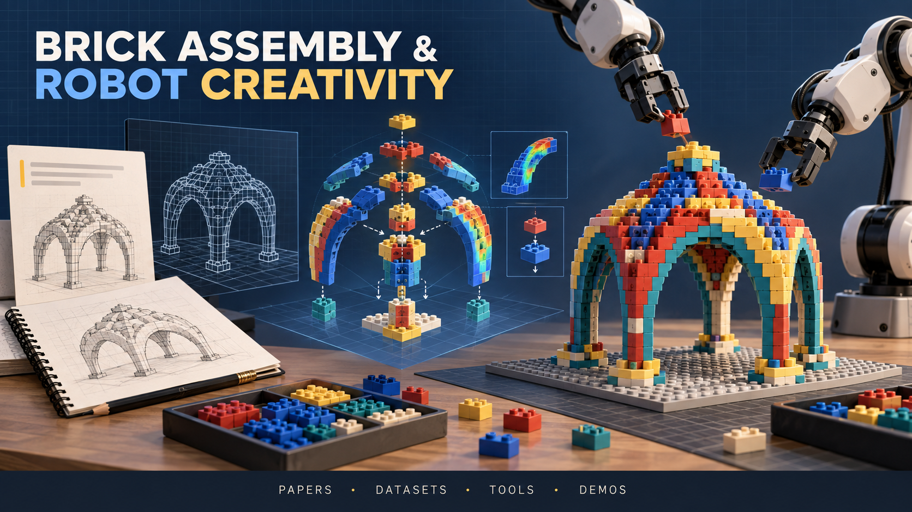

# Awesome Brick Assembly  & Robot Creativity 🤖

  
   
  Photo credit: OpenAI GPT

Brick assembly has drawn increasing research attention in recent years because it combines several key challenges central to Physical AI:

- **Semantic interpretation:** translating abstract design goals into concrete assembly requirements.
- **Physical reasoning:** accounting for geometry, contact, and structural stability.
- **Generalization:** adapting to diverse brick configurations and previously unseen tasks.
- **Planning over long horizons:** sequencing many interdependent assembly actions.
- **Precise manipulation:** handling miniature components within tight tolerances while preserving fragile connections.

Each challenge is a research problem in its own right. Their combination makes brick assembly a unified, accessible, and reproducible testbed for Physical AI.

This repository curates research papers on generative brick assembly design, physics modeling and simulation, reasoning and planning, robotic manipulation, and robot creativity. It also links to datasets, software tools, and public demos.

⭐ marks selected works. Venue labels are included when a publication venue is confirmed; unlabeled entries may be preprints.

## Contents
- [Awesome Brick Assembly  \& Robot Creativity 🤖](#awesome-brick-assembly---robot-creativity-)
  - [Contents](#contents)
  - [Surveys and Reviews](#surveys-and-reviews)
  - [1. Generative Design](#1-generative-design)
    - [From Text](#from-text)
    - [From Images and Visual Inputs](#from-images-and-visual-inputs)
    - [From Geometry and 3D Models](#from-geometry-and-3d-models)
    - [Other Inputs and Unconditional Generation](#other-inputs-and-unconditional-generation)
  - [2. Physics Modeling and Simulation](#2-physics-modeling-and-simulation)
  - [3. Perception, Reasoning and Planning](#3-perception-reasoning-and-planning)
  - [4. Robotic Manipulation](#4-robotic-manipulation)
  - [5. Robot Creativity](#5-robot-creativity)
  - [Datasets](#datasets)
  - [Events](#events)
  - [Tools and Demos](#tools-and-demos)
    - [Demos and Posts](#demos-and-posts)
    - [Useful Tools](#useful-tools)

## Surveys and Reviews

- [2021] [Computer Graphics Forum] **State of the Art on Computational Design of Assemblies with Rigid Parts** [Paper](https://diglib.eg.org/items/74b2381f-5e65-468f-98f9-05724924c805)
- [2018] [Computer Graphics Forum] **State of the Art on Stylized Fabrication** [Paper](https://vcg-legacy.isti.cnr.it/Publications/2018/BCMP18/)
- [2014] [WSCG Poster Papers] **Survey on Automated LEGO Assembly Construction** [Paper](https://dspace.zcu.cz/items/0d91fd58-c654-467b-b5db-bd80e5d084e2)

[Back to contents](#contents)

## 1. Generative Design

Generate and optimize brick and modular assembly structures from text, images, geometry, or other starting points.

### From Text

- ⭐ [2026] [CVPR] **BrickNet: Graph-Backed Generative Brick Assembly** [Paper](https://arxiv.org/abs/2604.22984) · [Project](https://kulits.github.io/BrickNet/)
- [2026] [IEEE Robotics & Automation Magazine] **Prompt-to-Product: Generative Assembly via Bimanual Manipulation** [Paper](https://arxiv.org/abs/2508.21063) · [Project](https://prompt2product.github.io/)
- ⭐ [2025] [ICCV] **Generating Physically Stable and Buildable Brick Structures from Text (BrickGPT/LegoGPT)** [Paper](https://openaccess.thecvf.com/content/ICCV2025/html/Pun_Generating_Physically_Stable_and_Buildable_Brick_Structures_from_Text_ICCV_2025_paper.html) · [Project](https://avalovelace1.github.io/BrickGPT/) · [Code](https://github.com/AvaLovelace1/BrickGPT)
- ⭐ [2025] [SIGGRAPH Asia] **LegoACE: Autoregressive Construction Engine for Expressive LEGO Assemblies** [Paper](https://doi.org/10.1145/3757377.3763881) · [Project](https://xh38.github.io/LegoACE/) · [Code](https://github.com/VAST-AI-Research/LegoACE) · [Models](https://huggingface.co/VAST-AI/LegoACE)
- [2025] [NeurIPS Creative AI] **Text to Robotic Assembly of Multi Component Objects using 3D Generative AI and Vision Language Models** [Paper](https://arxiv.org/abs/2511.02162)
- ⭐ [2025] [ICRA] **Blox-Net: Generative Design-for-Robot-Assembly Using VLM Supervision, Physics Simulation, and a Robot with Reset** [Paper](https://arxiv.org/abs/2409.17126) · [Project](https://bloxnet.org/)

### From Images and Visual Inputs

- [2026] [IEEE RA-L] **Prompt2Craft: Generating Functional Craft Assemblies with LLMs** [Paper](https://doi.org/10.1109/LRA.2026.3692045) · [Preprint](https://arxiv.org/pdf/2512.04568)
- [2025] [CoRL] **“Stack It Up!”: 3D Stable Structure Generation from 2D Hand-drawn Sketch** [Paper](https://arxiv.org/abs/2508.02093)
- [2025] [IROS] **StackGen: Generating Stable Structures from Silhouettes via Diffusion** [Paper](https://arxiv.org/abs/2409.18098) · [Project](https://ripl.github.io/StackGen/)
- ⭐ [2025] [SIGGRAPH Asia] **LegoACE: Autoregressive Construction Engine for Expressive LEGO Assemblies** [Paper](https://doi.org/10.1145/3757377.3763881) · [Project](https://xh38.github.io/LegoACE/) · [Code](https://github.com/VAST-AI-Research/LegoACE) · [Models](https://huggingface.co/VAST-AI/LegoACE)
- [2025] [SIGGRAPH Asia] **LEGO-Maker: Autoregressive Image-Conditioned LEGO Model Creation** [Paper](https://doi.org/10.1145/3763285)
- [2024] [IEEE RA-L] **Component Selection for Craft Assembly Tasks** [Paper](https://arxiv.org/abs/2407.14001)
- [2024] [SIGGRAPH] **Creating LEGO Figurines from Single Images** [Paper](https://doi.org/10.1145/3658167)
- [2023] [SIGGRAPH Asia] **Computational Design of LEGO Sketch Art** [Paper](https://doi.org/10.1145/3618306)
- [2022] [ICRA] **Brick Yourself within 3 Minutes** [Paper](https://air.tsinghua.edu.cn/en/Brick-Yourself-within-3-Minutes.pdf) · [Project](https://www.unicus.cn/research/31-20.html)
- [2021] [NeurIPS] **Brick-by-Brick: Combinatorial Construction with Deep Reinforcement Learning** [Paper](https://proceedings.neurips.cc/paper/2021/hash/2d4027d6df9c0256b8d4474ce88f8c88-Abstract.html) · [Code](https://github.com/POSTECH-CVLab/Brick-by-Brick)
- [2021] **Image2Lego: Customized LEGO Set Generation from Images** [Paper](https://arxiv.org/abs/2108.08477) · [Project](https://krlennon.github.io/image2lego/)
- [2020] [IEEE Access] **Generating 2D Lego Compatible Puzzles Using Reinforcement Learning** [Paper](https://doi.org/10.1109/ACCESS.2020.3016091)
- [2019] [SIGGRAPH Asia] **Computational LEGO Technic Design** [Paper](https://arxiv.org/abs/2007.02245) · [Project](https://xuhaocuhk.github.io/projects/compute_technic/)
- [2016] [Computer-Aided Design] **Automatic Generation of LEGO Building Instructions from Multiple Photographic Images of Real Objects** [Paper](https://doi.org/10.1016/j.cad.2015.06.020)
- [2015] [Pacific Graphics] **Pixel2Brick: Constructing Brick Sculptures from Pixel Art** [Paper](https://purehost.bath.ac.uk/ws/files/153552040/pixel2brick_pg2015.pdf)
- [2014] [SIGGRAPH Posters] **Blocklizer: Interactive Design of Stable Mini Block Artwork** [Paper](https://doi.org/10.1145/2614217.2614269)
- [2008] [Eurographics SBIM] **Using Sketches and Retrieval to Create LEGO Models** [Paper](https://diglib.eg.org/server/api/core/bitstreams/017d5534-3a1a-46f4-819b-c7f2a0e3287b/content)

### From Geometry and 3D Models

- [2026] **Rollback-Free Stable Brick Structures Generation** [Paper](https://arxiv.org/abs/2605.06947) · [Code and Data](https://github.com/miniHuiHui/STABLE)
- [2026] **BrickAnything: Geometry-Conditioned Buildable Brick Generation with Structure-Aware Tokenization** [Paper](https://arxiv.org/abs/2605.26182) · [Code](https://github.com/xjtunzy/BrickAnything)
- [2024] [Procedia CIRP] **Streamlining LEGO Model Design: An Automated Optimisation Approach** [Paper](https://www.sciencedirect.com/science/article/pii/S2212827124009314)
- [2022] [STAG] **Outside-in Priority-based Approximation of 3D Models in LEGO Bricks** [Paper](https://diglib.eg.org/items/bc1018bb-6728-42f7-8acb-6bab8e2201f9) · [Code and Data](https://univr-vips.github.io/bricks/)
- [2022] [Journal of Engineering Manufacture] **A Legorization Method Based on 3D Color Printing Trajectory** [Paper](https://doi.org/10.1177/09544054211053616)
- [2021] [Operations Research Forum] **Optimisation and Static Equilibrium of Three-Dimensional LEGO Constructions** [Paper](https://doi.org/10.1007/s43069-021-00062-3)
- [2021] [STAG] **Approximating Shapes with Standard and Custom 3D Printed LEGO Bricks** [Paper](https://diglib.eg.org/bitstreams/4bbcaec3-c9bc-4cdb-ada7-2eef51883640/download)
- [2021] [European Journal of Operational Research] **Models and Algorithms for Optimising Two-Dimensional LEGO Constructions** [Paper](https://doi.org/10.1016/j.ejor.2020.07.004)
- [2019] [Computer Graphics Forum] **Automatic Generation of Vivid LEGO Architectural Sculptures** [Paper](https://doi.org/10.1111/cgf.13603)
- [2018] [IEEE Access] **Split-and-Merge-Based Genetic Algorithm (SM-GA) for LEGO Brick Sculpture Optimization** [Paper](https://doi.org/10.1109/ACCESS.2018.2859039)
- [2018] [KSII TIIS] **Legorization from Silhouette-Fitted Voxelization** [Paper](https://doi.org/10.3837/tiis.2018.06.019)
- [2017] [CGI] **Legorization with Multi-Height Bricks from Silhouette-Fitted Voxelization** [Paper](https://doi.org/10.1145/3095140.3095180)
- [2016] [IROS] **From CAD Models to Toy Brick Sculptures: A 3D Block Printer** [Paper](https://doi.org/10.1109/IROS.2016.7759340)
- [2016] [The Visual Computer] **Inner Engraving for the Creation of a Balanced LEGO Sculpture** [Paper](https://doi.org/10.1007/s00371-015-1072-4)
- [2016] [SoCS] **A Multi-Phase Search Approach to the LEGO Construction Problem** [Paper](https://doi.org/10.1609/socs.v7i1.18385)
- ⭐ [2015] [SIGGRAPH Asia] **Legolization: Optimizing LEGO Designs** [Paper](https://www.cs.columbia.edu/~yonghao/siga15/abstsiga15.html)
- [2015] [Smart Graphics] **Designing Mini Block Artwork from Colored Mesh** [Paper](https://www.cgg.cs.tsukuba.ac.jp/projects/2015/mini_block_artwork/index.html)
- [2015] [GECCO] **Finding an Optimal LEGO Brick Layout of Voxelized 3D Object Using a Genetic Algorithm** [Paper](https://doi.org/10.1145/2739480.2754667)
- [2015] [URAI] **A Novel Genetic Algorithm for Autonomous Assembly of Structural LEGO Bricks** [Paper](https://doi.org/10.1109/URAI.2015.7358849)
- [2015] [ICACT] **Automated LEGO Assembly Construction by Interactive Selection from Multiple Optimization Techniques** [Paper](https://icact.org/upload/2015/0274/20150274_finalpaper.pdf)
- [2014] [CHI] **faBrickation: Fast 3D Printing of Functional Objects by Integrating Construction Kit Building Blocks** [Paper](https://hcie.csail.mit.edu/research/fabrickation/fabrickation.html)
- [2013] [ITE Transactions on Media Technology and Applications] **LEGO Builder: Automatic Generation of LEGO Assembly Manual from 3D Polygon Model** [Paper](https://doi.org/10.3169/mta.1.354)
- [2013] [Eurographics] **Automatic Generation of Constructable Brick Sculptures** [Paper](https://diglib.eg.org/items/82e2ee53-fa57-4929-ac81-85acd0d9f855)
- [2008] [MSc thesis] **Automated Brick Sculpture Construction** [Thesis](https://scholar.sun.ac.za/handle/10019.1/2288)
- [2008] [Automata] **Cellular Automata with Cell Clustering** [Paper](https://www.comunidad.escom.ipn.mx/genaro/Papers/Books_files/automata2008reducedsize.pdf)
- [2001] [Norsk Informatikkonferanse] **Solving LEGO Brick Layout Problem Using Evolutionary Algorithms** [Paper](https://dai.fmph.uniba.sk/~petrovic/pub/nik-brick.pdf)
- [1998] [Study Group Report] **LEGO: Automated Model Construction** [Paper](https://miis.maths.ox.ac.uk/623/index.html)

### Other Inputs and Unconditional Generation

- ⭐ [2026] [CVPR] **BrickNet: Graph-Backed Generative Brick Assembly** [Paper](https://arxiv.org/abs/2604.22984) · [Project](https://kulits.github.io/BrickNet/)
- [2025] [SCF] **Speech to Reality: On-Demand Production using Natural Language, 3D Generative AI, and Discrete Robotic Assembly** [Paper](https://arxiv.org/abs/2409.18390)
- [2024] [TMLR] **Budget-Aware Sequential Brick Assembly with Efficient Constraint Satisfaction** [Paper](https://arxiv.org/abs/2210.01021) · [Code](https://github.com/joonahn/BrECS)
- [2024] [SIGGRAPH Asia] **Learn to Create Simple LEGO Micro Buildings** [Paper](https://doi.org/10.1145/3687755) · [Code](https://github.com/Occulte/LEGO_Buildings_Generation)
- [2020] [NeurIPS ML4Eng Workshop] **Building LEGO Using Deep Generative Models of Graphs** [Paper](https://arxiv.org/abs/2012.11543) · [Code](https://github.com/uoguelph-mlrg/GenerativeLEGO)
- [2020] **Combinatorial 3D Shape Generation via Sequential Assembly** [Paper](https://arxiv.org/abs/2004.07414) · [Code](https://github.com/POSTECH-CVLab/Combinatorial-3D-Shape-Generation)
- [2012] [PPSN XII] **Buildable Objects Revisited** [Paper](https://www.cmap.polytechnique.fr/~nikolaus.hansen/proceedings/2012/PPSN/papers/7492/74920255.pdf)
- [2003] [AIEDAM] **Using Assembly Representations to Enable Evolutionary Design of LEGO Structures** [Paper](https://doi.org/10.1017/S0890060403172046)
- [1998] [Artificial Life] **Evolutionary Body Building: Adaptive Physical Designs for Robots** (evolved LEGO structures) [Paper](https://doi.org/10.1162/106454698568639) · [Author PDF](https://demo.cs.brandeis.edu/papers/funpolalife.pdf)
- [1997] [ECAL] **Computer Evolution of Buildable Objects** [Paper](https://www.demo.cs.brandeis.edu/papers/other/cs-97-191.html)

[Back to contents](#contents)

## 2. Physics Modeling and Simulation

Model connectivity, stability, contact forces, and assembly dynamics.

- ⭐ [2026] **BrickSim: A Physics-Based Simulator for Manipulating Interlocking Brick Assemblies** [Paper](https://arxiv.org/abs/2603.16853) · [Project](https://intelligent-control-lab.github.io/BrickSim/) · [Code](https://github.com/intelligent-control-lab/BrickSim)
- [2026] **Rollback-Free Stable Brick Structures Generation (STABLE)** [Paper](https://arxiv.org/abs/2605.06947) · [Code and Data](https://github.com/miniHuiHui/STABLE)
- ⭐ [2024] [IEEE RA-L] **StableLego: Stability Analysis of Block Stacking Assembly** [Paper](https://arxiv.org/abs/2402.10711) · [Code and Data](https://github.com/intelligent-control-lab/StableLego)
- [2023] **BrickFEM: An Automated Finite Element Model for Static and Dynamic Simulations of Simple LEGO Sets** [Paper](https://engrxiv.org/preprint/view/2898)
- [2022] [SIGGRAPH Asia] **Assemble Them All: Physics-Based Planning for Generalizable Assembly by Disassembly** (mechanical assemblies) [Paper](https://doi.org/10.1145/3550454.3555525) · [Project](https://assembly.csail.mit.edu/) · [Code and Data](https://github.com/yunshengtian/Assemble-Them-All)
- [2022] [Computer-Aided Design] **Coupled Rigid-Block Analysis: Stability-Aware Design of Complex Discrete-Element Assemblies** (rigid-block assemblies) [Paper](https://doi.org/10.1016/j.cad.2022.103216)
- [2021] [Operations Research Forum] **Optimisation and Static Equilibrium of Three-Dimensional LEGO Constructions** [Paper](https://doi.org/10.1007/s43069-021-00062-3)
- [2021] [European Journal of Operational Research] **Models and Algorithms for Optimising Two-Dimensional LEGO Constructions** [Paper](https://doi.org/10.1016/j.ejor.2020.07.004)
- [2020] [Automation in Construction] **Design and Automated Assembly of Planetary LEGO Brick for Lunar In-Situ Construction** [Paper](https://doi.org/10.1016/j.autcon.2020.103282)
- ⭐ [2015] [SIGGRAPH Asia] **Legolization: Optimizing LEGO Designs** [Paper](https://www.cs.columbia.edu/~yonghao/siga15/abstsiga15.html)
- [2012] [ESA] **Maximum Flow Networks for Stability Analysis of LEGO Structures** [Paper](https://doi.org/10.1007/978-3-642-33090-2_70)
- [2012] [PPSN XII] **Buildable Objects Revisited** [Paper](https://www.cmap.polytechnique.fr/~nikolaus.hansen/proceedings/2012/PPSN/papers/7492/74920255.pdf)
- [1998] [Artificial Life] **Evolutionary Body Building: Adaptive Physical Designs for Robots** (stability-guided LEGO evolution) [Paper](https://doi.org/10.1162/106454698568639) · [Author PDF](https://demo.cs.brandeis.edu/papers/funpolalife.pdf)
- [1997] [ECAL] **Computer Evolution of Buildable Objects** [Paper](https://www.demo.cs.brandeis.edu/papers/other/cs-97-191.html)

[Back to contents](#contents)

## 3. Perception, Reasoning and Planning

Reconstruct assembly states, reason about physical constraints, generate or interpret instructions, plan actions, and correct errors.

- [2026] [ICRA] **ActionReasoning: Robot Action Reasoning in 3D Space with LLM for Robotic Brick Stacking** [Paper](https://arxiv.org/abs/2602.21161)
- [2026] **EUPHORIA: Efficient Universal Planning via Hybrid Optimization for Robust Industrial Robotic Assembly** (architectural brick assembly) [Paper](https://arxiv.org/abs/2605.18872)
- [2026] [ICRA] **Manual2Skill++: Connector-Aware General Robotic Assembly from Instruction Manuals via Vision-Language Models** [Paper](https://arxiv.org/abs/2510.16344) · [Project](https://nus-lins-lab.github.io/Manual2SkillPP/) · [Code](https://github.com/crtie/Manual2SkillPP_official)
- [2026] [Machine Vision and Applications] **Deconstruct to Reconstruct: An Automated Pipeline for Parsing Complex CT Assemblies** [Paper](https://link.springer.com/article/10.1007/s00138-025-01717-5) · [Code and Data](https://github.com/sciai-lab/DeconstruCTscans)
- [2026] [ICRA] **IDfRA: Self-Verification for Iterative Design in Robotic Assembly** [Paper](https://arxiv.org/abs/2509.16998) · [Code](https://github.com/nishkakhendry/iterative_dfra)
- [2026] [CVPR] **From Manuals to Actions: A Unified VLA Model for Chain-of-Thought Manual Generation and Robotic Manipulation (ManualVLA)** [Paper](https://openaccess.thecvf.com/content/CVPR2026/html/Gu_From_Manuals_to_Actions_A_Unified_VLA_Model_for_Chain-of-Thought_CVPR_2026_paper.html)
- ⭐ [2026] **Brick-Composer: Using MLLMs for Assembly with Diverse Bricks** [Paper](https://arxiv.org/abs/2606.05445)
- [2026] [ICMI] **LEGO Co-builder: Exploring Fine-Grained Vision-Language Modeling for Multimodal LEGO Assembly Assistants** [Paper](https://arxiv.org/abs/2507.05515)
- [2026] [ICLR] **TPRU: Advancing Temporal and Procedural Understanding in Large Multimodal Models** (includes LEGO assembly sequences) [Paper](https://arxiv.org/abs/2602.18884) · [Data](https://huggingface.co/datasets/Stephengzk/TPRU-25k)
- [2026] **Sample-Efficient Post-Training for LEGO Spatial-Physics Reasoning** [Paper](https://arxiv.org/abs/2606.07602)
- [2026] [RoboCup] **WorkBenchMark: A LEGO-Based Assembly Benchmark with an Assembly-by-Disassembly Baseline for the Smart Manufacturing League** [Paper](https://arxiv.org/abs/2606.19358)
- [2025] [MECC] **AssemblyComplete: 3D Combinatorial Construction with Deep Reinforcement Learning** [Paper](https://arxiv.org/abs/2410.15469)
- [2025] [ACC] **Automating Robot Failure Recovery Using Vision-Language Models With Optimized Prompts** [Paper](https://arxiv.org/abs/2409.03966)
- [2025] **LEGO-Puzzles: How Good Are MLLMs at Multi-Step Spatial Reasoning?** [Paper](https://arxiv.org/abs/2503.19990)
- [2025] [AAAI] **Neural Assembler: Learning to Generate Fine-Grained Robotic Assembly Instructions from Multi-View Images** [Paper](https://ojs.aaai.org/index.php/AAAI/article/view/33613)
- ⭐ [2025] [IEEE RA-L] **Physics-Aware Combinatorial Assembly Sequence Planning Using Data-Free Action Masking** [Paper](https://arxiv.org/abs/2408.10162) · [Code](https://github.com/intelligent-control-lab/PhysicsAwareCombinatorialASP)
- ⭐ [2025] [RSS] **APEX-MR: Multi-Robot Asynchronous Planning and Execution for Cooperative Assembly** [Paper](https://arxiv.org/abs/2503.15836) · [Code](https://github.com/intelligent-control-lab/APEX-MR)
- [2025] [Journal of Imaging] **Effects of Biases in Geometric and Physics-Based Imaging Attributes on Classification Performance** [Paper](https://doi.org/10.3390/jimaging11100333) · [Data](https://data.nvision2.eecs.yorku.ca/LegoDataset/)
- [2025] [Robotics and Autonomous Systems] **Large-Scale Multi-Robot Assembly Planning for Autonomous Manufacturing** [Paper](https://arxiv.org/abs/2311.00192)
- [2025] [SIGGRAPH Immersive Pavilion] **Augmented Reality and Vision-Language Models to Guide Humans Across Manual Tasks** [Paper](https://authors.library.caltech.edu/records/242tm-f6y12)
- [2024] **Learning to Build by Building Your Own Instructions** [Paper](https://arxiv.org/abs/2410.01111)
- [2024] [Findings of ACL] **Autonomous Workflow for Multimodal Fine-Grained Training Assistants Towards Mixed Reality** [Paper](https://aclanthology.org/2024.findings-acl.240/) · [Code and Data](https://github.com/Jiahuan-Pei/AutonomousDialogAgent4AugmentedReality)
- [2024] [IROS] **Optimal Robotic Assembly Sequence Planning (ORASP): A Sequential Decision-Making Approach** (general modular assembly) [Paper](https://arxiv.org/abs/2310.17115) · [Code](https://github.com/labicon/ORASP-Code)
- [2024] [IEEE RA-L] **Decomposition-Based Hierarchical Task Allocation and Planning for Multi-Robots Under Hierarchical Temporal Logic Specifications** (LEGO assembly with two robot arms) [Paper](https://arxiv.org/abs/2308.10393) · [Code](https://github.com/XushengLuo92/Hierarchical-LTL)
- [2024] [IROS] **SCANet: Correcting LEGO Assembly Errors with Self-Correct Assembly Network** [Paper](https://arxiv.org/abs/2403.18195) · [Code and Data](https://github.com/kaichen-z/SCANet-Supp)
- [2024] [ECCV] **TreeSBA: Tree-Transformer for Self-Supervised Sequential Brick Assembly** [Paper](https://arxiv.org/abs/2407.15648) · [Project](https://dreamguo.github.io/projects/TreeSBA/) · [Code](https://github.com/dreamguo/TreeSBA)
- [2023] [CVPR] **MobileBrick: Building LEGO for 3D Reconstruction on Mobile Devices** [Paper](https://arxiv.org/abs/2303.01932) · [Project](https://code.active.vision/MobileBrick/) · [Code](https://github.com/ActiveVisionLab/MobileBrick)
- [2023] [Sensors] **Brickognize: Applying Photo-Realistic Image Synthesis for Lego Bricks Recognition with Limited Data** [Paper](https://www.mdpi.com/1424-8220/23/4/1898) · [Testing data](https://www.tramacsoft.com/wp-content/uploads/2022/12/brickognize_dataset.zip)
- [2023] [Scientific Data] **Photos and Rendered Images of LEGO Bricks** [Paper](https://pmc.ncbi.nlm.nih.gov/articles/PMC10657460/)
- [2023] [IEEE Transactions on Robotics] **Long-Horizon Multi-Robot Rearrangement Planning for Construction Assembly** [Paper](https://doi.org/10.1109/TRO.2022.3198020) · [Project](https://vhartmann.com/multi-robot/)
- [2023] [IROS] **Efficient and Feasible Robotic Assembly Sequence Planning via Graph Representation Learning** (aluminum-profile assemblies) [Paper](https://arxiv.org/abs/2303.10135) · [Code and Data](https://github.com/DLR-RM/GRACE)
- [2023] [ICRA] **Planning Assembly Sequence with Graph Transformer** [Paper](https://arxiv.org/abs/2210.05236) · [Code and Data](https://github.com/AIR-DISCOVER/ICRA_ASP)
- [2022] [ICML] **Blocks Assemble! Learning to Assemble with Large-Scale Structured Reinforcement Learning** [Paper](https://proceedings.mlr.press/v162/ghasemipour22a.html)
- [2022] [SIGGRAPH Asia] **Assemble Them All: Physics-Based Planning for Generalizable Assembly by Disassembly** (mechanical assemblies) [Paper](https://doi.org/10.1145/3550454.3555525) · [Project](https://assembly.csail.mit.edu/) · [Code and Data](https://github.com/yunshengtian/Assemble-Them-All)
- [2022] [IROS] **Assembly Planning from Observations under Physical Constraints** (assembly from a photograph) [Paper](https://arxiv.org/abs/2204.09616) · [Project](https://www.di.ens.fr/willow/research/assembly-planning/)
- [2022] [ECCV] **Break and Make: Interactive Structural Understanding Using LEGO Bricks** [Paper](https://arxiv.org/abs/2207.13738) · [Simulator](https://github.com/aaronwalsman/ltron) · [Training Code](https://github.com/aaronwalsman/ltron-torch-eccv22)
- [2022] **Cooperative Task and Motion Planning for Multi-Arm Assembly Systems** [Paper](https://arxiv.org/abs/2203.02475)
- ⭐ [2022] [ECCV] **Translating a Visual LEGO Manual to a Machine-Executable Plan** [Paper](https://arxiv.org/abs/2207.12572) · [Project](https://cs.stanford.edu/~rcwang/projects/lego_manual/) · [Code](https://github.com/Relento/lego_release)
- [2021] [NeurIPS] **Brick-by-Brick: Combinatorial Construction with Deep Reinforcement Learning** [Paper](https://proceedings.neurips.cc/paper/2021/hash/2d4027d6df9c0256b8d4474ce88f8c88-Abstract.html) · [Code](https://github.com/POSTECH-CVLab/Brick-by-Brick)
- [2021] [CoRL] **Learn2Assemble with Structured Representations and Search for Robotic Architectural Construction** (building-block structures) [Paper](https://proceedings.mlr.press/v164/funk22a.html) · [Project](https://sites.google.com/view/learn2assemble)
- [2020] [IRC] **How to Find Assembly Plans (Fast): Hierarchical State Space Partitioning for Efficient Multi-Robot Assembly** [Paper](https://doi.org/10.1109/IRC.2020.00034)
- [2020] [IROS] **LegoBot: Automated Planning for Coordinated Multi-Robot Assembly of LEGO Structures** [Paper](https://doi.org/10.1109/IROS45743.2020.9341428)
- [2019] [IROS] **Multi-Robot Assembly Sequencing via Discrete Optimization** (large-structure assembly) [Paper](https://msl.stanford.edu/papers/culbertson_multi-robot_2019.pdf) · [Code](https://github.com/pculbertson/ip-assembly-planning)
- [2019] [ICML] **Structured Agents for Physical Construction** [Paper](https://proceedings.mlr.press/v97/bapst19a.html) · [Environment](https://github.com/google-deepmind/dm_construction)
- [2019] [ICINCO] **Modular and Domain-Guided Multi-Robot Planning for Assembly Processes** [Paper](https://www.scitepress.org/PublishedPapers/2019/79772/)
- [2018] [Computer-Aided Design and Applications] **Transformation of LEGO Models** [Paper](https://doi.org/10.1080/16864360.2018.1477670)
- [2017] [Computer-Aided Design and Applications] **Component-Based Building Instructions for Block Assembly** [Paper](https://doi.org/10.1080/16864360.2016.1240450)
- [2016] [IROS] **From CAD Models to Toy Brick Sculptures: A 3D Block Printer** [Paper](https://doi.org/10.1109/IROS.2016.7759340)

[Back to contents](#contents)

## 4. Robotic Manipulation

Study robotic manipulation and execution for brick and modular assembly.

- [2026] **BrickCraft: Visuomotor Skill Composition with Situated Manual Guidance for Long-Horizon Interlocking Brick Assembly** [Paper](https://arxiv.org/abs/2605.07605) · [Project](https://intelligent-control-lab.github.io/BrickCraft/)
- [2026] **EUPHORIA: Efficient Universal Planning via Hybrid Optimization for Robust Industrial Robotic Assembly** (architectural brick assembly) [Paper](https://arxiv.org/abs/2605.18872)
- [2026] [IROS] **VAMP-MR: Vector-Accelerated Motion Planning and Execution for Multi-Robot-Arms** [Paper](https://arxiv.org/abs/2607.13478) · [Project](https://vamp-mr.github.io/vamp-mr/) · [Code](https://github.com/vamp-mr/vamp-mr)
- [2026] **Xiaomi-Robotics-0: An Open-Sourced Vision-Language-Action Model with Real-Time Execution** [Paper](https://arxiv.org/abs/2602.12684) · [Demo](https://robotics.xiaomi.com/xiaomi-robotics-0.html)
- [2026] [ICRA] **Manual2Skill++: Connector-Aware General Robotic Assembly from Instruction Manuals via Vision-Language Models** [Paper](https://arxiv.org/abs/2510.16344) · [Project](https://nus-lins-lab.github.io/Manual2SkillPP/)
- [2026] [RoboCup] **WorkBenchMark: A LEGO-Based Assembly Benchmark with an Assembly-by-Disassembly Baseline for the Smart Manufacturing League** [Paper](https://arxiv.org/abs/2606.19358) · [Demo](https://workbenchmark.github.io/)
- ⭐ [2026] [IEEE Robotics & Automation Magazine] **Prompt-to-Product: Generative Assembly via Bimanual Manipulation** [Paper](https://arxiv.org/abs/2508.21063) · [Project](https://prompt2product.github.io/)
- [2026] [CVPR] **From Manuals to Actions: A Unified VLA Model for Chain-of-Thought Manual Generation and Robotic Manipulation (ManualVLA)** [Paper](https://openaccess.thecvf.com/content/CVPR2026/html/Gu_From_Manuals_to_Actions_A_Unified_VLA_Model_for_Chain-of-Thought_CVPR_2026_paper.html)
- [2025] [NeurIPS Creative AI] **Text to Robotic Assembly of Multi Component Objects using 3D Generative AI and Vision Language Models** [Paper](https://arxiv.org/abs/2511.02162)
- [2025] [ICRA] **Blox-Net: Generative Design-for-Robot-Assembly Using VLM Supervision, Physics Simulation, and a Robot with Reset** [Paper](https://arxiv.org/abs/2409.17126) · [Project](https://bloxnet.org/)
- [2025] [IROS] **StackGen: Generating Stable Structures from Silhouettes via Diffusion** [Paper](https://arxiv.org/abs/2409.18098) · [Project](https://ripl.github.io/StackGen/)
- [2025] [SCF] **Speech to Reality: On-Demand Production using Natural Language, 3D Generative AI, and Discrete Robotic Assembly** [Paper](https://arxiv.org/abs/2409.18390)
- ⭐ [2025] [RSS] **APEX-MR: Multi-Robot Asynchronous Planning and Execution for Cooperative Assembly** [Paper](https://arxiv.org/abs/2503.15836) · [Code](https://github.com/intelligent-control-lab/APEX-MR)
- [2025] [IROS] **Eye-in-Finger: Smart Fingers for Delicate Assembly and Disassembly of LEGO** [Paper](https://arxiv.org/abs/2503.06848)
- [2024] [ISFA] **A Lightweight and Transferable Design for Robust LEGO Manipulation** [Paper](https://arxiv.org/abs/2309.02354)
- [2023] [CoRL] **Sequential Dexterity: Chaining Dexterous Policies for Long-Horizon Manipulation** [Paper](https://arxiv.org/abs/2309.00987) · [Project](https://sequential-dexterity.github.io/) · [Code](https://github.com/sequential-dexterity/SeqDex)
- [2023] [IEEE Transactions on Robotics] **Long-Horizon Multi-Robot Rearrangement Planning for Construction Assembly** [Paper](https://doi.org/10.1109/TRO.2022.3198020) · [Project](https://vhartmann.com/multi-robot/)
- [2023] [ACC Workshop] **Robotic LEGO Assembly and Disassembly from Human Demonstration** [Paper](https://arxiv.org/abs/2305.15667) · [Code](https://github.com/intelligent-control-lab/Robotic_LEGO_Assembly_and_Disassembly_from_Human_Demonstration)
- [2023] **Simulation-aided Learning from Demonstration for Robotic LEGO Construction** [Paper](https://arxiv.org/abs/2309.11010)
- [2022] [IROS] **Assembly Planning from Observations under Physical Constraints** (assembly from a photograph) [Paper](https://arxiv.org/abs/2204.09616) · [Project](https://www.di.ens.fr/willow/research/assembly-planning/)
- [2021] [CoRL] **Learn2Assemble with Structured Representations and Search for Robotic Architectural Construction** (building-block structures) [Paper](https://proceedings.mlr.press/v164/funk22a.html) · [Project](https://sites.google.com/view/learn2assemble)
- [2021] [ICRA] **IKEA Furniture Assembly Environment for Long-Horizon Complex Manipulation Tasks** (furniture assembly benchmark) [Paper](https://arxiv.org/abs/1911.07246) · [Environment](https://github.com/clvrai/furniture)
- [2020] [Automation in Construction] **Design and Automated Assembly of Planetary LEGO Brick for Lunar In-Situ Construction** [Paper](https://doi.org/10.1016/j.autcon.2020.103282)
- [2020] [IROS] **LegoBot: Automated Planning for Coordinated Multi-Robot Assembly of LEGO Structures** [Paper](https://doi.org/10.1109/IROS45743.2020.9341428)
- [2019] [ICRA] **A Learning Framework for High Precision Industrial Assembly** (LEGO brick insertion experiment) [Paper](https://doi.org/10.1109/ICRA.2019.8793659) · [Project](https://yongxf.github.io/ICRA2019/guidedddpg.html)
- [2017] **Data-efficient Deep Reinforcement Learning for Dexterous Manipulation** [Paper](https://arxiv.org/abs/1704.03073)
- [2016] [IROS] **From CAD Models to Toy Brick Sculptures: A 3D Block Printer** [Paper](https://doi.org/10.1109/IROS.2016.7759340)
- [2015] [ICRA] **Learning Contact-Rich Manipulation Skills with Guided Policy Search** [Paper](https://arxiv.org/abs/1501.05611) · [Demo](https://rll.berkeley.edu/icra2015gps/)

[Back to contents](#contents)

## 5. Robot Creativity

Explore creative robotic systems and related computational design methods, including work beyond bricks.

- ⭐ [2026] [IEEE Robotics & Automation Magazine] **Prompt-to-Product: Generative Assembly via Bimanual Manipulation** [Paper](https://arxiv.org/abs/2508.21063) · [Project](https://prompt2product.github.io/)
- [2026] [IEEE RA-L] **Prompt2Craft: Generating Functional Craft Assemblies with LLMs** [Paper](https://doi.org/10.1109/LRA.2026.3692045) · [Preprint](https://arxiv.org/pdf/2512.04568)
- [2026] [IEEE RA-L] **Visual Sculpting: Visually-Aligned Planning Representations for Long-Horizon Robot Clay Sculpting** [Paper](https://pschaldenbrand.github.io/sculpting/) · [Video](https://pschaldenbrand.github.io/sculpting/)
- [2026] [IEEE Robotics & Automation Magazine] **Artists’ Views on Robotics Involvement in Painting Productions: A Longitudinal Investigation of Human–Robot Artistic Collaboration in Abstract Painting** [Paper](https://doi.org/10.1109/MRA.2026.3693128)
- [2026] [ICRA] **IMPASTO: Integrating Model-Based Planning with Learned Dynamics Models for Robotic Oil Painting Reproduction** [Paper](https://arxiv.org/abs/2603.29315) · [Project](https://impasto-robopainting.github.io/)
- [2026] **RoboWits: Unexpected Challenges for Robotic Creative Problem Solving** [Paper](https://arxiv.org/abs/2605.30326) · [Benchmark and code](https://github.com/UMass-Embodied-AGI/RoboWits)
- [2026] **Creative Robot Tool Use by Counterfactual Reasoning** [Paper](https://arxiv.org/abs/2605.05411)
- [2026] **Alter-Art: Exploring Embodied Artistic Creation through a Robot Avatar** [Paper](https://arxiv.org/abs/2604.26473)
- [2025] [NeurIPS Creative AI] **Text to Robotic Assembly of Multi Component Objects using 3D Generative AI and Vision Language Models** [Paper](https://arxiv.org/abs/2511.02162)
- ⭐ [2025] [ICRA] **Blox-Net: Generative Design-for-Robot-Assembly Using VLM Supervision, Physics Simulation, and a Robot with Reset** [Paper](https://arxiv.org/abs/2409.17126) · [Project](https://bloxnet.org/)
- [2025] [ICRA Art in Robotics] **Generative AI and Minimalist Sculpture** [Paper](https://bloxnet.org/data/art_figures/bloxnet_art_in_robotics_icra_2025.pdf) · [Project](https://bloxnet.org/art)
- [2025] [SCF] **Speech to Reality: On-Demand Production using Natural Language, 3D Generative AI, and Discrete Robotic Assembly** [Paper](https://arxiv.org/abs/2409.18390)
- [2025] [CHI GenAICHI Workshop] **Making Physical Objects with Generative AI and Robotic Assembly: Considering Fabrication Constraints, Sustainability, Time, Functionality and Accessibility** [Paper](https://generativeaiandhci.github.io/papers/2025/genaichi2025_38.pdf)
- [2025] [CoRL] **Vocal Sandbox: Continual Learning and Adaptation for Situated Human-Robot Collaboration** [Paper](https://proceedings.mlr.press/v270/grannen25a.html) · [Project](https://vocal-sandbox.github.io/)
- [2025] [RO-MAN] **LLM-enhanced Interactions in Human-Robot Collaborative Drawing with Older Adults** [Paper](https://dare.uva.nl/id/e347cb00-435a-490b-8560-c79de28415bc)
- [2025] **ShapeShift: Text-to-Mosaic Synthesis via Semantic Phase-Field Guidance** [Paper](https://arxiv.org/abs/2503.14720)
- [2025] [IEEE RA-L] **Spline-FRIDA: Towards Diverse, Humanlike Robot Painting Styles with a Sample-Efficient, Differentiable Brush Stroke Model** [Paper](https://arxiv.org/abs/2412.00597) · [Project](https://lawrencedchen.com/splinefrida/)
- [2025] **Music-driven Robot Swarm Painting** [Paper](https://arxiv.org/abs/2506.00326)
- ⭐ [2024] [ICRA] **CoFRIDA: Self-Supervised Fine-Tuning for Human-Robot Co-Painting** [Paper](https://arxiv.org/abs/2402.13442) · [Project](https://pschaldenbrand.github.io/cofrida/)
- [2024] [IEEE RA-L] **Component Selection for Craft Assembly Tasks** [Paper](https://arxiv.org/abs/2407.14001)
- [2024] [IROS] **Robot Synesthesia: A Sound and Emotion Guided AI Painter** [Paper](https://arxiv.org/abs/2302.04850) · [Project](https://vihaanmisra.github.io/Robot-Synesthesia/)
- [2024] **LLM-Craft: Robotic Crafting of Elasto-Plastic Objects with Large Language Models** [Paper](https://arxiv.org/abs/2406.08648) · [Project](https://sites.google.com/andrew.cmu.edu/llmcraft)
- [2024] [IROS] **SculptDiff: Learning Robotic Clay Sculpting from Humans with Goal Conditioned Diffusion Policy** [Paper](https://arxiv.org/abs/2403.10401) · [Project](https://sites.google.com/andrew.cmu.edu/imitation-sculpting/home)
- [2024] [Humanoids] **RoPotter: Toward Robotic Pottery and Deformable Object Manipulation with Structural Priors** [Paper](https://arxiv.org/abs/2408.02184) · [Project](https://robot-pottery.github.io/)
- [2024] [IROS] **Architectural-Scale Artistic Brush Painting with a Hybrid Cable Robot** [Paper](https://arxiv.org/abs/2403.12214) · [Project and video](https://gerry-chen.com/projects/graffitibot/)
- [2024] [ICRA] **SculptBot: Pre-Trained Models for 3D Deformable Object Manipulation** [Paper](https://arxiv.org/abs/2309.08728) · [Project](https://sites.google.com/andrew.cmu.edu/sculptbot)
- [2024] **Text2Robot: Evolutionary Robot Design from Text Descriptions** [Paper](https://arxiv.org/abs/2406.19963) · [Project](https://generalroboticslab.com/Text2Robot/)
- [2023] [ICRA] **FRIDA: A Collaborative Robot Painter with a Differentiable, Real2Sim2Real Planning Environment** [Paper](https://arxiv.org/abs/2210.00664) · [Project](https://pschaldenbrand.github.io/frida/) · [Code](https://github.com/cmubig/Frida)
- [2023] [NeurIPS] **DiffuseBot: Breeding Soft Robots With Physics-Augmented Generative Diffusion Models** [Paper](https://arxiv.org/abs/2311.17053) · [Project](https://diffusebot.github.io/)
- [2023] [CoRL] **RoboCook: Long-Horizon Elasto-Plastic Object Manipulation with Diverse Tools** [Paper](https://arxiv.org/abs/2306.14447)
- [2023] [IEEE RA-L] **DALL-E-Bot: Introducing Web-Scale Diffusion Models to Robotics** [Paper](https://arxiv.org/abs/2210.02438)
- [2023] [CoRL Workshop] **Creative Robot Tool Use with Large Language Models** [Paper](https://arxiv.org/abs/2310.13065) · [Project and videos](https://creative-robotool.github.io/)
- [2022] [IROS] **Robot Learning to Paint from Demonstrations** [Paper](https://ieeexplore.ieee.org/document/9981633) · [Project](https://drawing-robot.github.io/)
- [2022] [Journal of Intelligent & Robotic Systems] **ShadowPainter: Active Learning Enabled Robotic Painting through Visual Measurement and Reproduction of the Artistic Creation Process** [Paper](https://doi.org/10.1007/s10846-022-01616-1)
- [2022] [RSS] **RoboCraft: Learning to See, Simulate, and Shape Elasto-Plastic Objects with Graph Networks** [Paper](https://arxiv.org/abs/2205.02909)
- [2022] [ICRA] **GTGraffiti: Spray Painting Graffiti Art from Human Painting Motions with a Cable Driven Parallel Robot** [Paper](https://doi.org/10.1109/ICRA46639.2022.9812008) · [Project and video](https://gerry-chen.com/projects/graffitibot/)
- [2020] [RO-MAN] **Artistic Style in Robotic Painting; a Machine Learning Approach to Learning Brushstroke from Human Artists** [Paper](https://arxiv.org/abs/2007.03647)
- [2020] [SIGGRAPH Asia] **RoboGrammar: Graph Grammar for Terrain-Optimized Robot Design** [Paper](https://people.csail.mit.edu/jiex/papers/robogrammar/paper.pdf) · [Project](https://people.csail.mit.edu/jiex/papers/robogrammar/index.html)
- [2016] [IROS] **From CAD Models to Toy Brick Sculptures: A 3D Block Printer** [Paper](https://doi.org/10.1109/IROS.2016.7759340)
- [1998] [Artificial Life] **Evolutionary Body Building: Adaptive Physical Designs for Robots** (evolved LEGO structures) [Paper](https://doi.org/10.1162/106454698568639) · [Author PDF](https://demo.cs.brandeis.edu/papers/funpolalife.pdf)

[Back to contents](#contents)

## Datasets

| Dataset | Contents | Links |
|---|---|---|
| **BrickNet Dataset** | 100,000+ human-designed LDraw objects and scenes; access by request. | [Dataset access](https://github.com/kulits/BrickNet/blob/master/DATA.md) · [Repository](https://github.com/kulits/BrickNet) |
| **LegoVerse** | 55,000+ models spanning 9,314 brick types; dataset files are not linked in the released code. | [Code](https://github.com/VAST-AI-Research/LegoACE) |
| **StableText2Brick** | 47,000+ stable brick structures with text descriptions. | [Data](https://huggingface.co/datasets/AvaLovelace/StableText2Brick) |
| **PointCloud2Brick (STABLE)** | Point-cloud and brick-sequence pairs derived from StableText2Brick. | [Data and code](https://github.com/miniHuiHui/STABLE) |
| **BRICKS** | Voxelizations of 33 shapes at three resolutions for LEGO brick-layout evaluation. | [Data and code](https://univr-vips.github.io/bricks/) |
| **StableLego** | 50,000+ objects with brick layouts and stability estimates. | [Data](https://drive.google.com/file/d/1rcSVNjyjlxW698D5Ok_LKSLKK77r08-h/view?usp=sharing) · [Repository](https://github.com/intelligent-control-lab/StableLego) |
| **LEGO Micro-Buildings** | Micro-building models for learned generation. | [Repository](https://github.com/Occulte/LEGO_Buildings_Generation) |
| **Combinatorial 3D Shape Generation Dataset** | Primitive-based objects for sequential construction. | [Repository](https://github.com/POSTECH-CVLab/Combinatorial-3D-Shape-Generation) |
| **LDraw Official Model Repository** | Community-maintained LDraw models of official sets. | [Repository](https://omr.ldraw.org/) |
| **BC-Bench / Brick-Composer data** | Diverse-brick selection and pose evaluation, human-designed LEGO models, and synthetic assembly examples. | [Assembly data](https://huggingface.co/datasets/Lumos-Jiateng/Brick-Composer-Data) · [Brick designs](https://huggingface.co/datasets/Lumos-Jiateng/bricklink_lego_design) · [Repository](https://github.com/Lumos-Jiateng/Brick-Composer) |
| **BrickAGI** | Community benchmark for LLM-generated LEGO designs, including assembly and buildability checks. | [Benchmark and code](https://github.com/withtally/brickagi) |
| **RoboWits** | Robot tool-use and assembly-reasoning tasks with demonstrations; the trajectory files require accepting the dataset's access conditions. | [Benchmark tasks and code](https://github.com/UMass-Embodied-AGI/RoboWits) · [Trajectories](https://huggingface.co/datasets/XHRlyb2001/RoboWits_lerobot_dataset) |
| **IKEA Furniture Assembly Environment** | Simulated long-horizon furniture assembly tasks with multiple robot platforms and furniture models. | [Environment repository](https://github.com/clvrai/furniture) |
| **WorkBenchMark** | 400 Duplo assembly tasks across four complexity levels. | [Data](https://github.com/WorkBenchMark/dataset) |
| **TreeSBA datasets** | RAD, RAD-S, MNIST-C, and ModelNet-C for sequential brick assembly from multiview images. | [Data](https://huggingface.co/datasets/dreamer001/TreeSBA_Dataset) · [Repository](https://github.com/dreamguo/TreeSBA) |
| **BrECS dataset** | Brick assembly structures used for sequential generation experiments. | [Data](https://drive.google.com/file/d/1-nlrNyKRHOn7sBZvtvk9BcutN7mLNzfB/view?usp=sharing) · [Repository](https://github.com/joonahn/BrECS) |
| **LEGO assembly sequence planning dataset** | LEGO models, heterogeneous graphs, and assembly sequences for graph-transformer planning. | [Data and code](https://github.com/AIR-DISCOVER/ICRA_ASP) |
| **LEGO Co-builder** | Visual states and instructions for multimodal assembly assistants. | [Data](https://huggingface.co/datasets/PPPPPeter/arta) · [Repository](https://github.com/peterhuang-coding/LEGO-Co-builder) |
| **TPRU (LEGO assembly subset)** | Image sequences for temporal ordering and next- or previous-step reasoning; LEGO assembly is one of several source domains. | [Training data](https://huggingface.co/datasets/Stephengzk/TPRU-25k) · [Test data](https://huggingface.co/datasets/Stephengzk/TPRU-test) · [Repository](https://github.com/Stephen-gzk/TPRU) |
| **LEGO-Puzzles** | 1,100 visual questions across spatial understanding and single- and multi-step reasoning. | [Repository](https://github.com/Tangkexian/LEGO-Puzzles) |
| **LEGO-MRTA** | Multimodal LEGO manuals, dialogue, mixed-reality responses, and visual questions. | [Data](https://huggingface.co/datasets/voxreality/vox_arta_lego_v2) · [Repository](https://github.com/Jiahuan-Pei/AutonomousDialogAgent4AugmentedReality) |
| **RC-Vehicles (LTRON)** | Procedural LEGO vehicles for learning visual assembly instructions. | [Data and simulator](https://github.com/aaronwalsman/ltron/tree/v1.1.0) |
| **LEGO-ECA** | Partial builds, assembly errors, and corrective labels. | [Dataset repository](https://github.com/kaichen-z/SCANet-Supp) |
| **LTRON / Break and Make** | Simulated disassembly and reconstruction of brick models. | [Simulator](https://github.com/aaronwalsman/ltron) |
| **MEPNet LEGO Manuals** | Three visual-manual datasets for assembly planning. | [Repository](https://github.com/Relento/lego_release) |
| **MobileBrick** | Mobile RGB-D captures of 153 brick sets with 3D annotations. | [Data](https://www.robots.ox.ac.uk/~victor/data/MobileBrick/MobileBrick_Mar23.zip) · [Repository](https://github.com/ActiveVisionLab/MobileBrick) |
| **LEGO assembly CT scans** | Seven annotated CT scans of complex LEGO assemblies with 450–3,600 parts each. | [Data](https://zenodo.org/records/15730445) · [Repository](https://github.com/sciai-lab/DeconstruCTscans) |
| **Human LEGO assembly motion** | Upper-limb trajectories from five image-guided human assembly tasks. | [Data](https://github.com/intelligent-control-lab/Human_Assembly_Data) |
| **YUBI UMI Arena** | Robot trajectories including LEGO assembly and disassembly; competition registration required. | [Dataset access](https://huggingface.co/datasets/airoa-org/yubi-corl2026-umi-arena) |
| **Photos and Rendered Images of LEGO Bricks** | Brick photographs, renders, and annotated detection images. | [Photos and renders](https://doi.org/10.34808/rcza-jy08) · [Rendered images](https://doi.org/10.34808/xfgk-6f77) · [Tagged images](https://doi.org/10.34808/anq4-rn44) · [Tagged photos](https://doi.org/10.34808/7kk9-tn08) |
| **Brickognize testing data** | Annotated real-world LEGO brick recognition images in controlled and uncontrolled settings. | [Data ZIP](https://www.tramacsoft.com/wp-content/uploads/2022/12/brickognize_dataset.zip) |
| **The Lego Dataset** | Synthetic LEGO brick images spanning shape, color, orientation, pose, and size for recognition-bias analysis. | [Data](https://data.nvision2.eecs.yorku.ca/LegoDataset/) |
| **B200C LEGO Classification Dataset** | Approximately 800,000 synthetic images across 200 brick classes. | [Data](https://www.kaggle.com/datasets/ronanpickell/b200c-lego-classification-dataset) · [Generator](https://github.com/korra-pickell/LEGO-Classification-Dataset) |
| **B200 LEGO Detection Dataset** | 2,000 synthetic detection images with about 800,000 instances across 200 brick classes. | [Data](https://www.kaggle.com/datasets/ronanpickell/b100-lego-detection-dataset) |

[Back to contents](#contents)

## Events

**[Creativity in Assembly — IROS 2026](https://sites.google.com/view/creative-assembly-workshop):** Workshop on generative intelligence, reasoning, planning, and robotic manipulation for creative assembly (October 1, 2026).

**[Embodied4Arts — RSS 2026](https://embodied4arts.github.io/):** Workshop on embodied systems for physical artistic creation.

**[2nd RoCo Challenge — IROS 2026](https://rocochallenge.github.io/RoCo-IROS2026/):** Robotic collaborative assembly challenge with brick-assembly and industrial board-assembly tracks.

[Back to contents](#contents)

## Tools and Demos

Research code and project pages are linked beside the relevant papers.

### Demos and Posts

| Organization | What it shows | Links |
|---|---|---|
| Carnegie Mellon University | A humanoid robot assembles a brick structure. | [Story](https://www.cmu.edu/news/stories/archives/2026/february/meet-the-robots) · [Video](https://www.youtube.com/watch?v=nIoGJUJTTTs) |
| Carnegie Mellon University | Dual arms assemble a brick structure generated from a text prompt. | [Project](https://prompt2product.github.io/) · [Video](https://www.youtube.com/watch?v=F1cG9U48noc) |
| Autodesk | BrickBot selects and assembles LEGO bricks from a CAD design. | [Article](https://adsknews.autodesk.com/en/stories/can-machine-learning-turn-industrial-robots-masters-assembly-construction/) |
| Generalist AI | A robot copies a three-brick structure after observing a human-built example. | [Blog](https://generalistai.com/blog/the-robots-build-now-too) · [Video](https://www.youtube.com/watch?v=eF9PqpPB0MM) |
| Generalist AI | A robot separates assembled bricks and sorts them into color-matched bins. | [Blog](https://generalistai.com/blog/research-preview) · [Video](https://www.youtube.com/watch?v=3YV5dzvTvco) |
| Dexmal | Multiple robots collaborate on a Great Wall model built from small interlocking bricks. | [Event page](https://www.worldrobotconference.com/expo/event/244.html) · [Video post](https://x.com/Dexmal_AI/status/2095403201378033719) |
| 1X | NEO assembles a small LEGO structure in a demonstration of its dexterous hands. | [Blog](https://www.1x.tech/discover/neos-hands) · [Video](https://www.youtube.com/watch?v=QRyXV3csReA) |
| Xiaomi Robotics | A bimanual robot disassembles LEGO structures with up to 20 bricks. | [Project and videos](https://robotics.xiaomi.com/xiaomi-robotics-0.html) |
| DOBOT | An X-Trainer robot assembles LEGO bricks during a live company demonstration. | [Event post](https://www.dobot-robots.com/insights/news/dobot-showcased-new-excellence-at-partner-events-2024-shaping-the-future-of-automation.html) |
| RWTH Aachen University | A robot perceives, plans, and assembles five LEGO Duplo benchmark tasks. | [Project and videos](https://workbenchmark.github.io/) |
| Carnegie Mellon University | Multiple robots cooperatively assemble commercial LEGO structures. | [APEX-MR project and videos](https://intelligent-control-lab.github.io/APEX-MR/) |
| UC Berkeley | Blox-Net generates prompt-driven block structures and assembles them with a robot. | [Project and videos](https://bloxnet.org/) · [Art study](https://bloxnet.org/art) |
| University of Massachusetts Amherst | RoboWits shows bimanual creative tool use and assembly-reasoning tasks. | [Project and videos](https://umass-embodied-agi.github.io/RoboWits/) |
| Georgia Tech | A cable robot spray-paints graffiti and brush-paints an architectural-scale mural. | [Project and videos](https://gerry-chen.com/projects/graffitibot/) |
| University of Michigan | Artists collaborate with an autonomous robot arm on abstract paintings. | [Story and photos](https://www.robotics.umich.edu/news/2026/artists-paint-with-robots-to-study-creative-expression/) |
| CoRL 2025 demo team | A low-cost robot turns text prompts into physical line drawings. | [Demo and video](https://sites.google.com/view/corl2025-demo-artistic-robot) |
| TEMEX | A training production line combines robotic and manual assembly of LEGO-based products. | [Case study and video](https://www.temex.cz/en/references/educational-lines/smartfactory-training-line/) |
| Universal Robots | A robot and a person jointly assemble a LEGO rocket. | [Video](https://video.universal-robots.com/a-robot-learns-to-jointly-assemble-a-lego-rocket) |

### Useful Tools

For brick model creation and exchange:

| Tool | Purpose |
|---|---|
| [LDraw](https://www.ldraw.org/) | Open brick-model format and parts library |
| [LeoCAD](https://www.leocad.org/) | Open-source editor for LDraw models |
| [BrickLink Studio](https://www.bricklink.com/v3/studio/download.page) | Brick design, rendering, instructions, and inventories |
| [BrickHub](https://brickhub.org/) | Share and browse digital brick models |

**License:** [MIT](LICENSE). Linked works retain their own licenses; please cite the original research.
